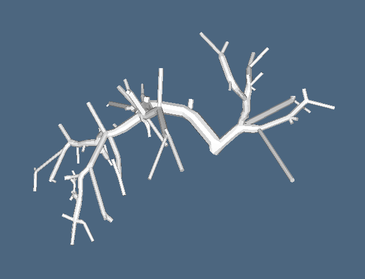

skelet3d
========

Package is constructed to analyse vessel tree structures. Length, radius and branching angles can be computed.
Skeletonization algorithm is based on [ITKThinningImageFilter3D](http://hdl.handle.net/1926/1292). 
There is dynamic linked library installed by cmake. Python and Matlab 
scripts call this library. 

Prerequisites
=============

  * Python (2.7)
  * CMake
  * ITK
  * Numpy
  * InsightToolkit

## Ubuntu 

Tested on Ubuntu 12.04, 14.04 and 16.04. Check [install notes](install_linux.md) for more information.

Install prerequisites 

    sudo apt-get install cmake python-numpy libinsighttoolkit3-dev libpng12-dev libgdcm2-dev python-pip
    
Install python package

    pip install skelet3d

To build `.so` libraries you will need download skelet3d sources:

    cd build
    cmake ..
    make
    make install

## Windows 

Tested on Windows 10 64-bit 
 
* Install numpy. Recommended is installation with [Anaconda](https://www.continuum.io/downloads) 
* Download [DLL libraries](http://147.228.240.61/queetech/install/ITK%2bSkelet3D_dll.zip) 
into directory in environment PATH (e.g. `c:\Windows\System32` ) or [build it yourself](build_windows.md)
* Install skelet3d
        
        pip install skelet3d
 

## Matlab

For matlab wrapper run src/compile.m

    matlab -nodesktop -nosplash -r "cd src;compile;exit"

Then there is binaryThhinningMex.mexa64 file. It is used by skelet3d.m.

Example
=======

Simple example with donut shape

    import skelet3d
    import numpy as np

    # Create donut shape
    data = np.ones([3,7,9])
    data [:, 3, 3:6] = 0

    skelet = skelet3d.skelet3d(data)

    print(skelet)

Result:

    array([[[0, 0, 0, 0, 0, 0, 0, 0, 0],
            [0, 0, 0, 0, 0, 0, 0, 0, 0],
            [0, 0, 0, 0, 0, 0, 0, 0, 0],
            [0, 0, 0, 0, 0, 0, 0, 0, 0],
            [0, 0, 0, 0, 0, 0, 0, 0, 0],
            [0, 0, 0, 0, 0, 0, 0, 0, 0],
            [0, 0, 0, 0, 0, 0, 0, 0, 0]],

            [[0, 0, 0, 0, 0, 0, 0, 0, 0],
            [0, 0, 1, 1, 1, 1, 1, 0, 0],
            [0, 1, 0, 0, 0, 0, 0, 1, 0],
            [0, 1, 0, 0, 0, 0, 0, 1, 0],
            [0, 1, 0, 0, 0, 0, 0, 1, 0],
            [0, 0, 1, 1, 1, 1, 1, 0, 0],
            [0, 0, 0, 0, 0, 0, 0, 0, 0]],

            [[0, 0, 0, 0, 0, 0, 0, 0, 0],
            [0, 0, 0, 0, 0, 0, 0, 0, 0],
            [0, 0, 0, 0, 0, 0, 0, 0, 0],
            [0, 0, 0, 0, 0, 0, 0, 0, 0],
            [0, 0, 0, 0, 0, 0, 0, 0, 0],
            [0, 0, 0, 0, 0, 0, 0, 0, 0],
            [0, 0, 0, 0, 0, 0, 0, 0, 0]]], dtype=uint8)
            
            
For more examples with skeleton analysis or visualisation see [example directory](https://github.com/mjirik/skelet3d/tree/master/examples)

Troubleshooting
===============

Problems with build
-------------------

In case of any problems You can use binary files and manually copy it into 
expected paths. BinaryThinningCxxShared library should be in `/usr/local/lib` 
on Linux or somewhere in system `PATH` on windows. Python module `skelet3d.py`
can be used directly.

Cannot find library
-------------------

libBinaryThinningCxxShared.so: cannot open shared object file: No such file or 
directory

Probably there is a problem in Ubuntu with `LD_LIBRARY_PATH`. If you do want 
to add correct library paths:

    echo "include /usr/local/lib" | sudo tee -a /etc/ld.so.conf
    sudo ldconfig -v

More information on:

http://bugs.python.org/issue18502

http://ubuntuforums.org/showthread.php?t=1498755

Cannot find library 2
---------------------

`libBinaryThinningCxxShared.so` is expected to be in `/usr/local/lib` and in `~/miniconda2/lib`

OSError
-------

OSError: /home/.../lib-dynload/../../libBinaryThinningCxxShared.so:
undefined symbol: _ZN3itk15ExceptionObject11SetLocationERKSs

WindowsError:[Error193]
-----------------------

You are probably using 32-bit skeleton build with 64-bit python

ld cannot find -lz and -lpng
-----------------------------

Problem is probabli in 32-bit compiling in 64-bit system. You need install fallowing packages. 
    
    sudo apt-get install lib32z1-dev libpng12-dev

Windows: missing `mscvp140.dll` and `vcruntime140.dll`
------------------------------------------------------

Install 
[Visual C++ 2015 Redistributable](https://www.microsoft.com/cs-cz/download/details.aspx?id=48145)
